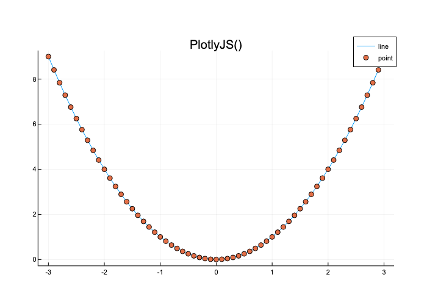
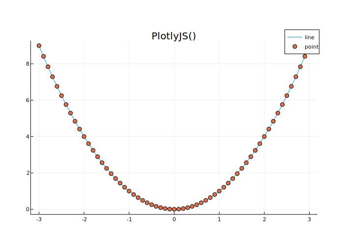

This code is borrowed from this [forum post](https://discourse.julialang.org/t/plots-plotlyjsbackend-is-displayed-as-gr/46902/2)

```Julia
using Plots
plotlyjs();
x=-3:0.1:3
f(x)=x^2
y=f.(x)
p=plot(x,y,label="line")
scatter!(x,y,label="point")
title!("PlotlyJS()")
```

There are multiple formats in which you can save the figure, for instance

```Julia
savefig(p,"plot.png");
savefig(p,"plot.svg");
savefig(p,"plot.json");
```

Here's the PNG output 



Here's the SVG output 



Here's the JSON output


